# Explainable Deep Learning for Brain Tumour Detection

Comparative analysis of CNN and ResNet models for binary brain MRI classification (**tumour vs no tumour**) with integrated **Grad-CAM explainability** and **Azure-ready web deployment**.

---

## Project Highlights

- **Task:** Binary brain MRI slice classification
- **Models compared:** `SimpleCNN`, `DeepCNN`, `StrongCNN`, `ResNet50`
- **Best model:** `ResNet50` (transfer learning)
- **Explainability:** Grad-CAM (original + heatmap + overlay)
- **System stack:** Flask API + React frontend + MySQL + Blob-style storage
- **Deployment target:** Microsoft Azure

---

## Suggested README Visual Flow (where to place images)

Use these images from `images_presentation/` in this order:

1. **Project overview / system context**  
   `images_presentation/clinicalWorkflowStages.jpg`
2. **Model architecture comparison**  
   `images_presentation/4modelArchitechtureDiagram.jpg`
3. **Training behavior and result evidence**  
   `images_presentation/simpleCNNTestResult.jpg`  
   `images_presentation/deepCNNTestResult.jpg`  
   `images_presentation/strongCNNTestResult.jpg`  
   `images_presentation/resnet50TestResult.jpg`
4. **Head-to-head performance**  
   `images_presentation/simpleCNNAndResnet50ComparisonOfRocCurve.jpg`  
   `images_presentation/resnet50ConfusionMatrix.jpg`
5. **Explainability examples**  
   `images_presentation/gradcamTumourExampleOriginalHeatmapOverlay.jpg`  
   `images_presentation/gradcamNoTumorExampleOriginalHeatmapOverlay.jpg`
6. **Deployment architecture**  
   `images_presentation/azureCloudDeploymentArchitecture.jpg`
7. **Live system screenshots**  
   `images_presentation/demoUserLoginPage.jpg`  
   `images_presentation/demoDoctorPredictionResultPage.jpg`  
   `images_presentation/doctorPredictionHistoryPage.jpg`

---

## Overview

Brain tumour assessment in MRI is difficult because of heterogeneous tumour appearance, acquisition variability, and overlap with normal tissue.  
While deep learning can achieve high offline accuracy, many works do not provide interpretability and deployable workflows.

This project bridges that gap through 3 pillars:

1. **Rigorous model comparison** (CNN baselines vs transfer learning)
2. **Integrated explainability** (Grad-CAM per prediction)
3. **Web-based deployment** (API + UI + persistence)


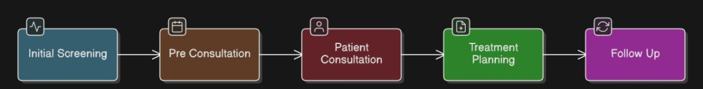
*Figure: Clinical context motivating explainable and deployable AI support.*

---

## Model Development

### Architectures Compared

- **SimpleCNN** (lightweight baseline)
- **DeepCNN** (deeper from-scratch model)
- **StrongCNN** (heavier regularization + augmentation)
- **ResNet50** (ImageNet pretrained transfer learning)

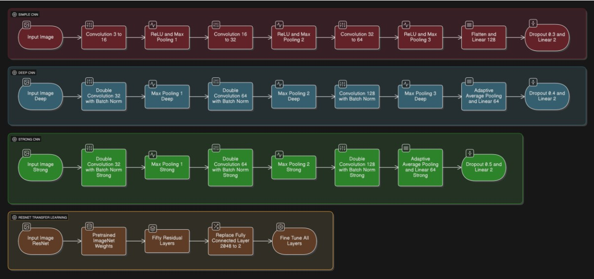
*Figure: Architectures evaluated under a common protocol.*

### Dataset and Preprocessing

- Source: Kaggle Br35H brain MRI dataset
- Total images: **3000** (balanced: 1500 tumour, 1500 no tumour)
- Input size: **224×224 RGB**
- Split: **70/15/15** stratified
- Normalization: ImageNet mean/std

---

## Results Summary

### Test Result Snapshots

| Model | Test Accuracy | Test AUC | Key Observation |
|---|---:|---:|---|
| SimpleCNN | 98.44% | 0.9993 | Strong lightweight baseline |
| DeepCNN | 89.78% | 0.9232 | Unstable, weaker generalization |
| StrongCNN | 92.00% | 0.9625 | Better stability, still below SimpleCNN |
| ResNet50 | **99.78%** | **1.0000** | Best overall, selected for deployment |

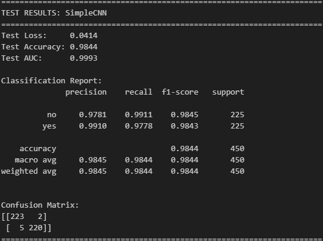
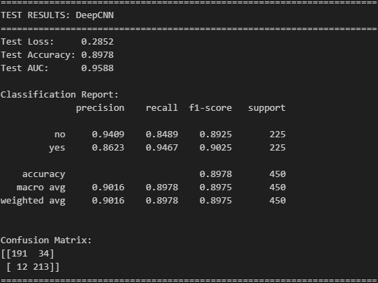
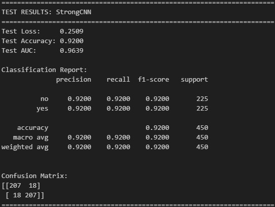
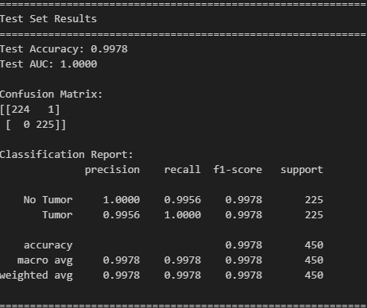

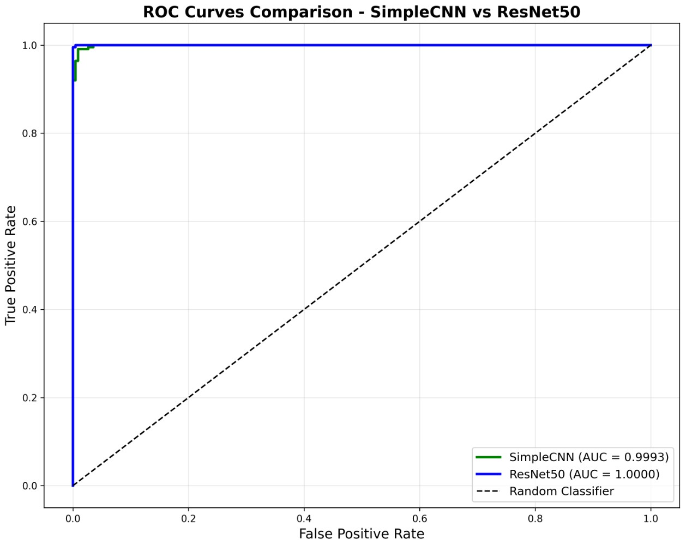
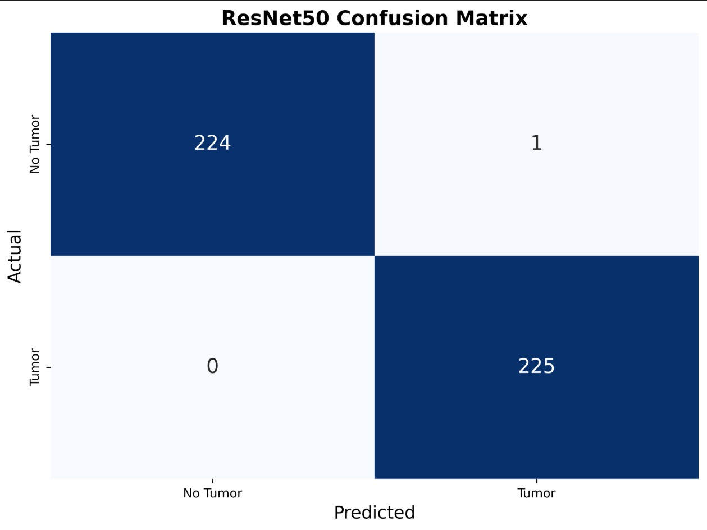
*Figure: ResNet50 achieved best discrimination with clinically safer error profile.*

---

## Explainability with Grad-CAM

Each prediction returns:

- Predicted class and confidence
- Grad-CAM heatmap
- Overlay view for visual review

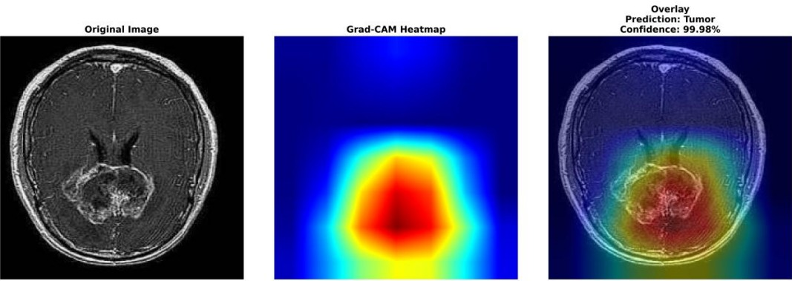
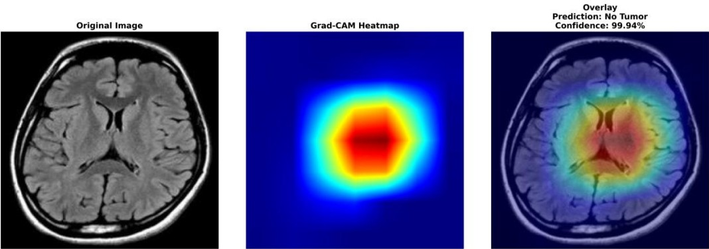
*Figure: Tumour-positive focal attention vs no-tumour diffuse attention.*

---

## System Architecture and Deployment

- **Frontend:** React + Tailwind
- **Backend:** Flask + PyTorch + OpenCV
- **Database:** MySQL
- **Storage:** upload + Grad-CAM outputs
- **Target cloud:** Azure App Service + Storage + MySQL

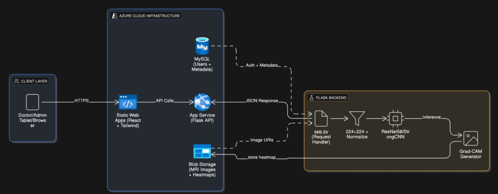

### Live Workflow (UI)

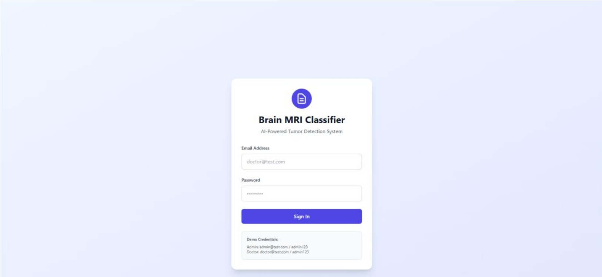
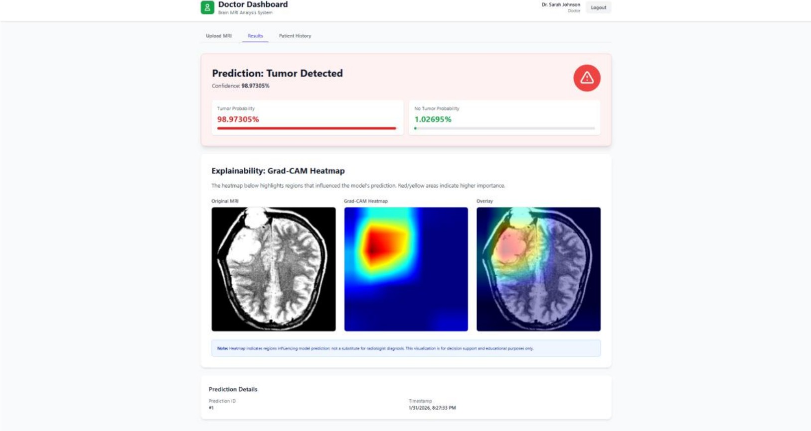
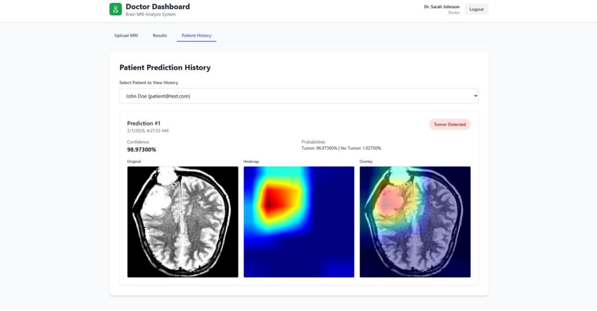

---

## Repository Structure

```text
Project/
├── application/
│   ├── backend/                  # Flask API, model inference, auth, DB routes
│   └── frontend/                 # React UI
├── dataset/                      # Raw dataset
├── dataset_processed/            # Train/val/test processed splits
├── eda-and-preprocessing/        # EDA + preprocessing notebooks
├── cnn/                          # CNN training notebook and outputs
├── resnet/                       # ResNet50 training notebook and outputs
├── comparison/                   # Model comparison notebook + metrics
├── gradcam_resnet/               # Grad-CAM notebook
├── images_presentation/          # Presentation/blog/README figures
├── project_presentation.md       # MARP presentation
└── README.md                     # This file
```

---

## Local Setup

### 1) Backend

```bash
cd application/backend
pip install -r requirements.txt
python app.py
```

Backend default: `http://localhost:5000`

### 2) Frontend

```bash
cd application/frontend
npm install
npm start
```

Frontend default: `http://localhost:3000`

### 3) Optional API Test

```bash
cd application/backend
python test_api.py
```

---

## Key Endpoints

- `GET /health`
- `POST /api/auth/login`
- `POST /api/predict`
- `GET /api/predictions/history`
- `GET /api/predictions/<id>`

---

## Limitations

- Single-source public dataset
- Binary classification only
- 2D slice-level analysis
- Prototype decision-support system (not a certified medical device)

---

## Future Work

- External/multi-centre validation
- Multi-class tumour classification
- 3D volumetric context
- Uncertainty calibration and monitoring
- Clinical integration and compliance pathway

---

## Citation

If you use this project, please cite the capstone work:

**Mohamed Faizal Mohamed Fawaz**  
*Explainable Deep Learning for Brain Tumour Detection: Comparative Analysis of CNN and ResNet Models with Web-Based Deployment*.
